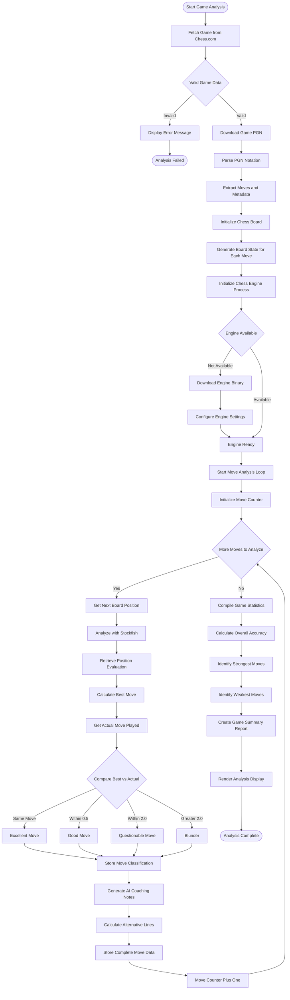
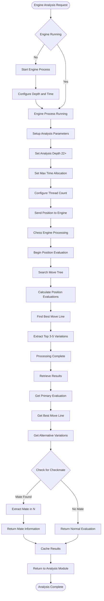
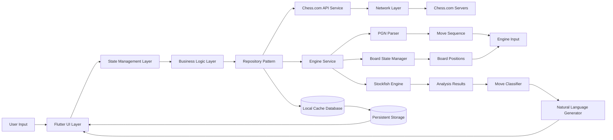
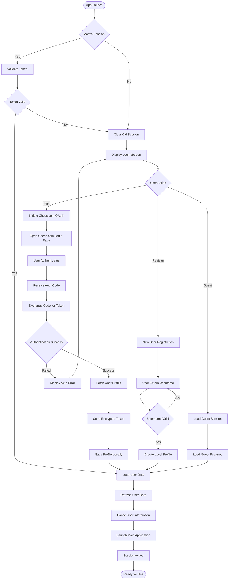
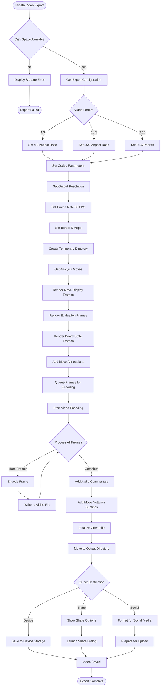
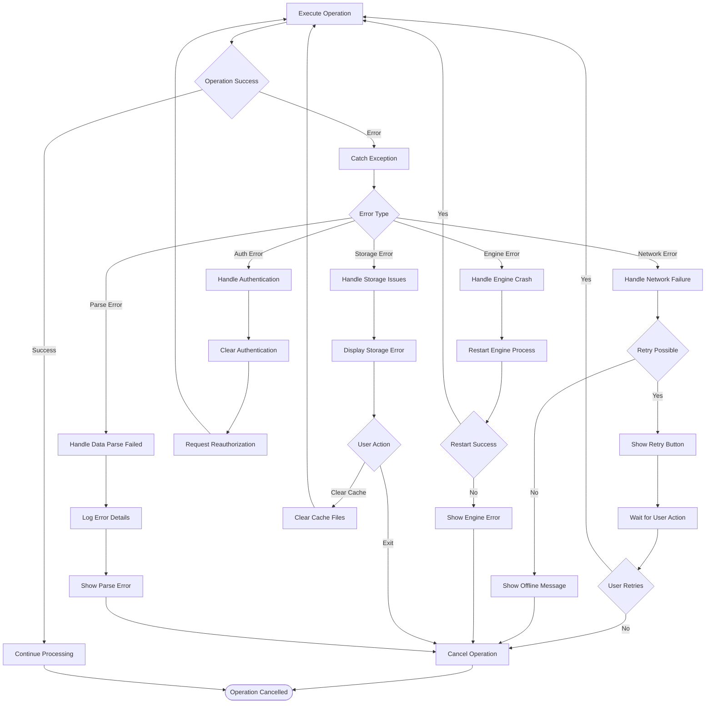
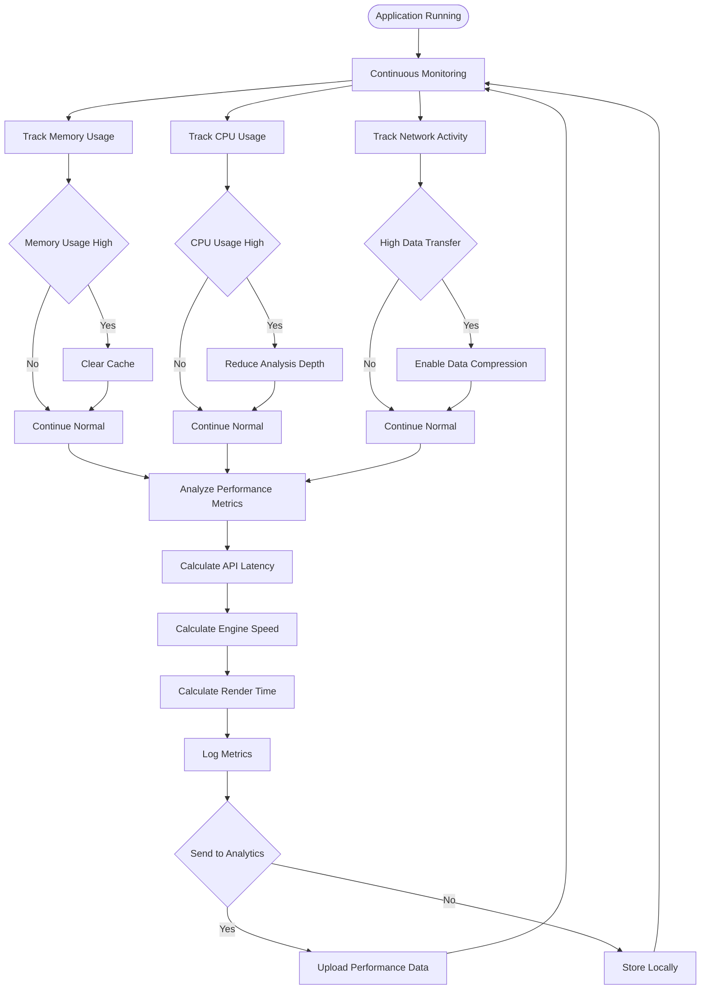

# Brilliant Movee - Chess Analysis Application

Brilliant Movee is a Dart/Flutter application that connects Chess.com with advanced chess engine analysis, delivering professional tactical coaching through an elegant interface. This application bridges the gap between raw engine data and human-readable tactical analysis, providing players with comprehensive insights into their game performance.

---

## Project Overview

Brilliant Movee combines Chess.com game data with real-time engine analysis to deliver professional-grade coaching and performance metrics. The application processes game histories, analyzes move quality, and presents insights in a clean, intuitive interface designed for desktop and mobile platforms.

The platform features real-time rankings, detailed performance analytics, and automated analysis workflows that turn complex chess engine evaluations into actionable feedback for improvement.

### Core Features

- Deep Engine Analysis: Advanced chess engine integration running analysis at significant depth levels
- Performance Dashboard: Professional dashboard displaying move quality breakdowns and performance metrics
- Global Rankings: Real-time rankings across multiple game categories (Rapid, Blitz, Bullet, and more)
- Move Classification: Automatic identification and classification of significant moves with detailed analysis
- Video Export: Automated recording and export of game reviews for sharing
- Cross-Platform Support: Seamless experience across mobile devices, tablets, and web browsers
- Game Archive Integration: Access to complete game history from Chess.com
- Natural Language Analysis: AI-powered coaching and move explanations
- High-Fidelity Rendering: Professional-quality board and UI rendering

---

## Complete System Architecture Flowchart

```mermaid
graph TD
    Start([User Launches Application]) --> CheckAuth{User Authenticated}
    CheckAuth -->|No| AuthFlow[Chess.com OAuth Flow]
    AuthFlow --> StoreCredentials[Store Encrypted Credentials]
    StoreCredentials --> MainDashboard
    CheckAuth -->|Yes| MainDashboard[Display Main Dashboard]
    
    MainDashboard --> UserChoice{User Action}
    
    UserChoice -->|Browse Games| HistoryFlow[Navigate to Game History]
    UserChoice -->|View Profile| ProfileFlow[View Performance Dashboard]
    UserChoice -->|Search Player| SearchFlow[Global Leaderboard Search]
    UserChoice -->|Analyze Game| ReviewFlow[Game Analysis]
    
    HistoryFlow --> FetchGames[Fetch Game Data from Chess.com API]
    FetchGames --> ParseGames[Parse Game Metadata]
    ParseGames --> CacheGames[Store in Local Cache]
    CacheGames --> DisplayList[Display Game List with Filters]
    DisplayList --> SelectGame{User Selects Game}
    SelectGame -->|Select| ReviewFlow
    SelectGame -->|Back| MainDashboard
    
    ProfileFlow --> FetchStats[Fetch Player Statistics]
    FetchStats --> CalculateMetrics[Calculate Performance Metrics]
    CalculateMetrics --> DisplayProfile[Render Analytics Dashboard]
    DisplayProfile --> BackProfile{User Action}
    BackProfile -->|Back| MainDashboard
    BackProfile -->|View Game| HistoryFlow
    
    SearchFlow --> InputSearch[User Enters Player Name]
    InputSearch --> QueryAPI[Query Chess.com Rankings API]
    QueryAPI --> DisplayResults[Show Player Rankings]
    DisplayResults --> SelectPlayer{Select Player}
    SelectPlayer -->|View| ProfileFlow
    SelectPlayer -->|Back| MainDashboard
    
    ReviewFlow --> LoadPGN[Load Game PGN Notation]
    LoadPGN --> ParsePGN[Parse PGN into Moves]
    ParsePGN --> BuildBoardStates[Generate Board States for Each Move]
    BuildBoardStates --> InitEngine[Initialize Chess Engine]
    InitEngine --> EngineReady{Engine Ready}
    
    EngineReady -->|Ready| StartAnalysis[Begin Position Analysis]
    EngineReady -->|Error| EngineError[Display Engine Error]
    EngineError --> ReviewFlow
    
    StartAnalysis --> AnalysisLoop{Process All Moves}
    AnalysisLoop -->|Remaining Moves| GetPosition[Get Next Position]
    GetPosition --> AnalyzePosition[Analyze Position with Engine]
    AnalyzePosition --> GetEvaluation[Retrieve Engine Evaluation]
    GetEvaluation --> CalculateDepth[Analyze at Depth 22+]
    CalculateDepth --> GetBestMove[Determine Best Move]
    GetBestMove --> CompareActual[Compare with Actual Move]
    CompareActual --> ClassifyMove[Classify Move Quality]
    ClassifyMove --> StoreEvaluation[Store Position Evaluation]
    StoreEvaluation --> AnalysisLoop
    
    AnalysisLoop -->|All Done| GenerateCoaching[Generate AI Coaching Text]
    GenerateCoaching --> CreateVariations[Create Alternative Variations]
    CreateVariations --> RenderBoard[Render Interactive Analysis Board]
    RenderBoard --> DisplayAnalysis[Display Move-by-Move Analysis]
    DisplayAnalysis --> UserAnalysisChoice{User Action}
    
    UserAnalysisChoice -->|Explore Move| ExploreVariation[Show Alternative Lines]
    ExploreVariation --> DisplayAnalysis
    
    UserAnalysisChoice -->|View Stats| MoveStats[Display Move Classification Stats]
    MoveStats --> DisplayAnalysis
    
    UserAnalysisChoice -->|Export Video| VideoExport[Prepare Video Export]
    VideoExport --> RenderFrames[Render Board Frames]
    RenderFrames --> EncodeVideo[Encode Video File]
    EncodeVideo --> ExportOptions{Export Format}
    ExportOptions -->|Social Media| PrepareShare[Format for Social Media]
    ExportOptions -->|Local Save| SaveFile[Save to Device Storage]
    PrepareShare --> UploadPrompt[Prompt User to Share]
    SaveFile --> ExportComplete[Export Complete]
    UploadPrompt --> ExportComplete
    ExportComplete --> DisplayAnalysis
    
    UserAnalysisChoice -->|Back| MainDashboard
    
    MainDashboard --> End([Session End])
```



---

## Detailed Game Analysis Process Flowchart



---

## Engine Analysis Deep Dive Flowchart



---

## Data Flow Architecture



---

## User Authentication and Session Management Flowchart



---

## Video Export and Rendering Pipeline Flowchart



---

## Error Handling and Recovery Flowchart



---

## Performance Metrics Monitoring Flowchart



---

## Project Structure

```
lib/
  core/
    - Global theme configuration
    - Application constants
    - Shared utilities and helpers
    - Style definitions
    - Error handling utilities
    
  data/
    - Chess.com API models
    - Data repositories
    - API integration services
    - Local storage models
    - Cache management
    
  engine/
    - Chess engine bridge
    - PGN notation parser
    - Board state manager
    - Move classifier
    - Position evaluator
    - Variation calculator
    
  features/
    home/
      - Application dashboard
      - Global leaderboard display
      - Player search functionality
      - Quick stats view
      
    history/
      - Game history browser
      - Archive access interface
      - Game list display
      - Filtering and sorting
      
    profile/
      - Performance analytics dashboard
      - Statistical breakdowns
      - Progress tracking
      - Achievement display
      
    review/
      - Interactive analysis board
      - Move-by-move analysis
      - AI coaching interface
      - Variation exploration
      - Export controls
      
assets/
  - Board and piece graphics
  - UI icons and graphics
  - Theme assets
  - Custom visualizations
```

---

## Technology Stack

### Frontend Framework
- Dart Programming Language (83.9% of codebase)
- Flutter Framework for cross-platform UI
- HTML for web components (16.1% of codebase)

### State Management
- Reactive programming patterns
- Efficient state updates
- Local state caching

### Data Storage
- Local persistence system
- Encrypted credential storage
- Game cache management

### Integration Points
- Chess.com public API integration
- External engine support
- Video encoding services
- Platform-specific services

---

## Installation and Setup

### System Requirements
- Dart SDK version 3.4.0 or higher
- Flutter Framework compatible version
- Minimum 2GB RAM for engine analysis
- Internet connection for API access

### Development Setup

Clone the repository:
```bash
git clone https://github.com/shiliaiwei/brilliant_movee
cd brilliant_movee
```

Install dependencies:
```bash
flutter pub get
```

Run the application:
```bash
flutter run
```

Generate code for models:
```bash
dart run build_runner build
```

### Build Instructions

Build for Android:
```bash
flutter build apk --release
```

Build for iOS:
```bash
flutter build ios --release
```

Build for Web:
```bash
flutter build web --release
```

Build for macOS:
```bash
flutter build macos --release
```

The compiled artifacts are available in the build/ directory.

---

## Application Workflow Details

### Game Analysis Process

1. User initiates game review through the history interface
2. Application loads game data from local cache or Chess.com
3. PGN notation is parsed into individual moves and positions
4. Engine begins position analysis from game start
5. Each position is evaluated with comprehensive analysis
6. Move quality is determined based on engine evaluation
7. Coaching feedback is generated for significant moves
8. UI renders interactive board with analysis overlay
9. User can explore variations and alternative moves
10. Optional export generates shareable video content

### Performance Optimization

- Background isolate processing for engine analysis
- Incremental data loading and caching
- Lazy rendering of board positions
- Network request optimization
- Local storage for frequently accessed games

### Data Management

- Automatic cache management
- Secure credential storage
- Efficient game history caching
- Bandwidth optimization
- Storage space management

---

## Configuration

### API Configuration
- Chess.com API endpoint configuration
- Rate limiting settings
- Timeout parameters
- Connection retry policies

### Engine Configuration
- Analysis depth settings
- Time control parameters
- Multi-threaded processing options
- Memory allocation settings

### UI Configuration
- Theme customization
- Layout preferences
- Animation settings
- Accessibility options

---

## Performance Metrics

### Analysis Speed
- Real-time board evaluation
- Sub-second move classification
- Efficient position caching
- Optimized variation calculation

### Memory Usage
- Efficient data structures
- Smart cache management
- Memory pooling for common objects
- Garbage collection optimization

### Network Performance
- Minimal API requests
- Efficient data compression
- Connection pooling
- Request batching

---

## Troubleshooting Guide

### Common Issues

Engine Analysis Not Starting
- Verify system has sufficient RAM
- Check engine process initialization
- Review engine configuration settings
- Ensure no conflicting processes

Chess.com Connection Failed
- Verify internet connectivity
- Check API endpoint availability
- Review authentication credentials
- Check rate limiting status

Video Export Issues
- Verify sufficient disk space
- Check video encoding configuration
- Ensure platform has codec support
- Review file permissions

Game Data Not Loading
- Clear local cache
- Verify Chess.com account access
- Check API response status
- Review game format compatibility

---

## Development Guidelines

### Code Organization
- Feature-based folder structure
- Separation of concerns
- Clear dependency flow
- Reusable component design

### Testing
- Unit test coverage for business logic
- Widget tests for UI components
- Integration tests for workflows
- Performance benchmarks

### Naming Conventions
- Clear, descriptive variable names
- Consistent method naming patterns
- Organized import statements
- Meaningful class and file names

---

## Roadmap and Future Enhancements

### Planned Features
- Enhanced AI coaching with more detailed variations
- Advanced statistics and trend analysis
- Multiplayer game analysis features
- Tournament integration and analysis
- Advanced filtering and search capabilities
- Expanded performance metrics
- Additional export formats
- Mobile app optimizations

### Optimization Goals
- Faster engine analysis
- Improved memory efficiency
- Better offline capabilities
- Enhanced UI responsiveness
- Expanded platform support

---

## Community and Support

### Getting Help
- Documentation available in project repository
- Code comments and inline documentation
- Example implementations in features
- Common issues and solutions in documentation

### Contributing
- Code contributions welcome
- Bug reports and feature requests accepted
- Documentation improvements encouraged
- Performance optimization suggestions valued

---

## Version Information

Current Version: Active Development
Last Updated: 2026
Platform Support: Flutter (Multi-platform)
Minimum SDK Requirements: Flutter 3.4.0 or higher

---

## Developed by shiliaiwei
