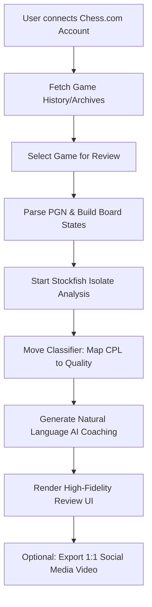

# ♟️ Stupid Brilliant — Chess Analysis Evolved

**Stupid Brilliant** is a premium chess analysis platform designed to turn raw game data into professional tactical narratives. Powered by Stockfish 16 and a sophisticated move classification engine, it provides deep insights, accuracy metrics, and high-fidelity game reconstructions for competitive players.

---

## 🚀 Project Overview

Stupid Brilliant bridges the gap between raw engine data and human-readable tactical coaching. It features a "Deep Space" aesthetic, high-resolution rendering, and automated social media video generation.

### ✨ Key Features
- **Deep Engine Analysis**: Stockfish 16 running in a dedicated isolate (Depth 22+).
- **Insights Profile**: A professional dashboard mirroring "Chess.com Insights" with move quality breakdowns.
- **Global Leaderboards**: Real-time rankings across all Chess.com categories (Rapid, Blitz, Bullet, etc.).
- **Smart Move Classification**: Identification of Brilliant (!!), Great (!), and Blunder (??) moves with natural language coaching.
- **1:1 Video Export**: Automated board recording for social media (TikTok/Reels).
- **Responsive Design**: Seamless experience across Mobile, Tablet, and Web.

---

## 🛠 Project Flow & Architecture

### 📊 System Workflow


### 🏗 Architecture Layers
- **Presentation (Flutter)**: Feature-first modular UI using Riverpod for reactive state management.
- **Domain (Repositories)**: Unified data access layer for Chess.com API.
- **Engine (Stockfish)**: Multi-threaded engine bridge using background isolates.
- **Infrastructure (Services)**: Local persistence (Hive), Audio, and Frame-by-frame Recording.

---

## 📂 Project Structure

- `lib/core`: Global theme, constants, and shared utilities.
- `lib/data`: Models and repositories for Chess.com integration.
- `lib/engine`: Stockfish integration, PGN parsing, and Move Classification.
- `lib/features`:
  - `/home`: Global leaderboard and search.
  - `/history`: Real-time game fetch and archive browser.
  - `/profile`: "Insights" style performance dashboard.
  - `/review`: Interactive analysis board and AI coach.
- `assets/classification`: Custom high-fidelity PNG icons for move quality.

---

## 🚀 Installation & Build

### Prerequisites
- Flutter SDK `^3.4.0`
- Android Studio / VS Code
- Git

### Build Release APK
```bash
flutter build apk --release
```
The latest APK is available in the `release/` folder.

---

## 🌟 Acknowledgments
- **Stockfish**: The world's strongest open-source chess engine.
- **Chess.com**: For public API access and data consistency.
- **Cburnett Assets**: Standard professional piece sets.
- **FFmpeg**: Powering the high-performance video encoding pipeline.

---
Developed by **shiliaiwei**
